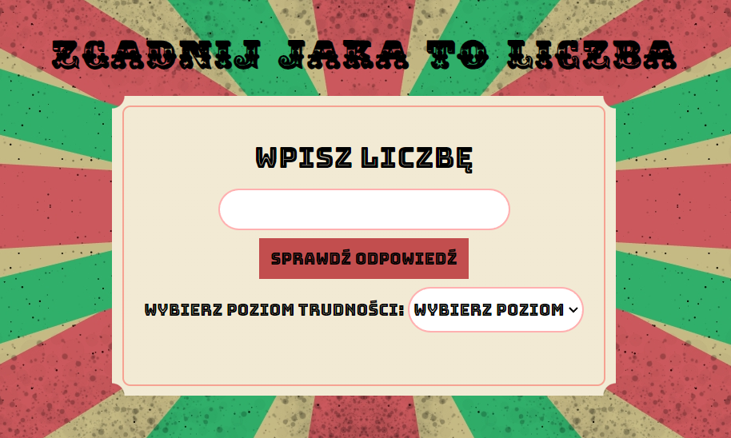

# Julia Odziewa - Guessing game

## Demo
[Guessing-game](https://juliaodziewa.github.io/Guessing-game/)

## Description

This is a simple web game where your goal is to guess the randomly generated number drawn by the game. To play, you need to enter your guess in the provided text field. The game will provide feedback to help you in your quest to find the correct number. There are three levels of difficulty available:

- Easy (łatwy) with a number range of 1-100.
- Medium (średni) with a number range of 1-500.
- Hard (trudny) with a number range of 1-1000.

## How to Play
1. Select the desired difficulty level from the available options: Easy, Medium, or Hard.
2. Enter your guess in the text field provided.
3. Read the feedback provided by the game. It will inform you if your guess was too high or too low.
4. Based on the feedback, make another guess by entering a new number in the text field.
5. Continue guessing until you find the correct number.
6. Once you guess the correct number, the game will display a congratulatory message

## Technology
- CSS
- BEM
- HTML
- JAVASCRIPT ES6+